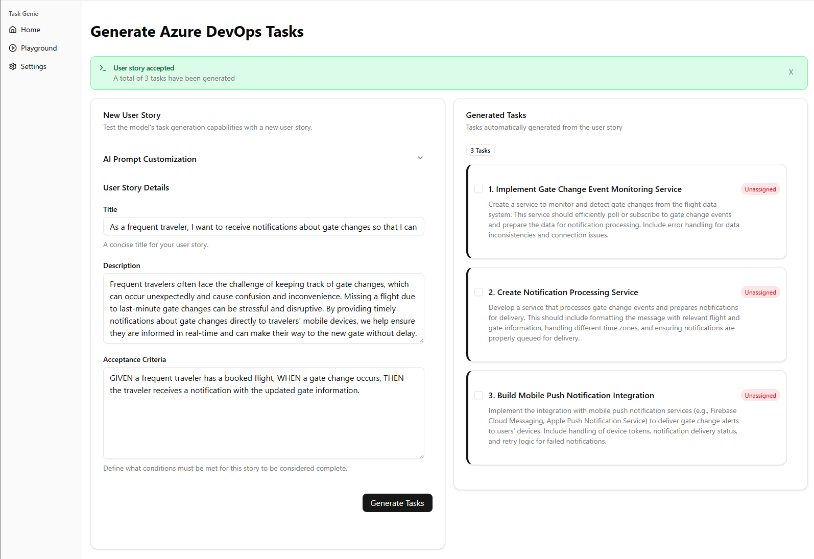

# Task Genie

<div style="display: flex; align-items: center;">
   
   <span>Task Genie is an AI assistant that integrates directly in Azure DevOps Boards to ensure the completeness of user stories and automatically helps breaks them down into actionable tasks, streamlining the Agile process and enhancing developer productivity.
</span>
</div>

## Features

1. User Story Validation

   - Ensures user stories follow best practices
   - Identifies missing components in user stories
   - Provides suggestions to improve clarity and completeness
   - NEW: Uses RAG to support additional context like tech details, domain context, application knowledge, etc.

2. Task Breakdown

   - Automatically decomposes validated user stories into smaller, actionable tasks
   - Ensures tasks align with agile methodologies for efficient development
   - 

3. Azure DevOps Boards integration

   - Supports integration with Azure DevOps Boards to automatically update work items and tasks

4. Powerful Insights

   - Built-in dashboards to visualize performance and effectiveness of task generation
   - Offers recommendations for improving workflows based on historical data
   - Detects potential bottlenecks or ambiguities in user stories
   - 

## Architecture

The architecture is deployed in AWS using a serverless model with Step Functions orchestrating the AI workflow. Integration with Azure DevOps is done through Service Hooks for each board.


A state machine, leveraging AWS Step Functions, orchestrates the workflow for the interaction with the LLM.


### Technology

|                                                                                                                                      |     Technology      |
| :----------------------------------------------------------------------------------------------------------------------------------: | :-----------------: |
|           | Amazon Web Services |
|       |       Next.js       |
|     |      ShadCn UI      |
|  |    Tailwind CSS     |
|    |     TypeScript      |

### Limitations

1. Azure DevOps Service Hooks limitations

   ⚠️ Azure DevOps Service Hooks can only be configured to trigger on one or all fields when a work item is updated. So when the Title, Description, and Acceptance Criteria of a work item is updated, Task Genie will be triggered 3 times, resulting in 3x the number of tasks being generated. ⚠️

2. Azure DevOps Personal Access Tokens

   ⚠️ The current implementation uses an Azure DevOps Personal Access Token which is tied to a user. Task Genie can be updated to use an Azure Service Principal once this is created (TASK0224374). ⚠️

3. Amazon Bedrock Knowledge Bases

   ⚠️ Task Genie uses S3 Vectors for the Knowledge Base Data Store, which is currently not supported in CloudFormation. As such, the Bedrock Knowledge Base needs to be manually created in the console and the IDs need to be set in the `.env` file. ⚠️

## Pricing

Estimated monthly costs (USD) for running in an AWS ###:

| Service                   | Rate (us-west-2)                      | Quantity | Estimated cost |
| ------------------------- | ------------------------------------- | -------- | -------------- |
| CloudWatch                | $3 per dashboard                      | 1        | $3.00          |
| Amplify                   | $0.01 per minute                      | 10       | $0.10          |
| Lambda                    | $0.0000166667 per GB-second           | 100,000  | $1.67          |
| Step Functions            | $0.00001667 per GB-second             | 100,000  | $1.67          |
| Bedrock (Claude 4 Sonnet) | $3.00/1M (input) / $15.00/1M (output) | 1        | $18.00         |
| **TOTAL (estimated)**     |                                       |          | **$24.44**     |

## Getting Started

### Pre-requisites

1. Create a [Personal Access Token](https://amaabca.visualstudio.com/_usersSettings/tokens) in AzureDevOps (until service principal is setup)

2. Encode the token with BASE 64 (save for next steps)

### Deployment

#### CDK

1. Update the `/infrastructure/.env` file with the parameters:

   ```
   AZURE_DEVOPS_PERSONAL_ACCESS_TOKEN=
   GITHUB_ORGANIZATION=
   AWS_BEDROCK_MODEL_ID=
   ```

2. Install dependencies

   ```
   npm run install
   ```

3. Deploy the backend

   ```
   npm run deploy
   npm run deploy-prod
   ```

⚠️ NOTE: Amazon S3 Vectors for Bedrock Knowledge Bases is not yet supported in CloudFormation/CDK. As such, the Bedrock Knowledge Base needs to be manually created in the AWS console.

4. Create a Bedrock Knowledge Base

   - Ensure the Chunking strategy is set to `Semantic chunking` with a `Maz token size for a chunk` = 150
     
   - Select `S3 Vectors` as the Data Source with the Knowledge Base Data Source Bucket from the deployment (step 3)

5. Update the `/infrastructure/.env` with the created Bedrock Knowledge Base ID and Bedrock Knowledge Base Data Source ID

   ```
   AWS_BEDROCK_KNOWLEDGE_BASE_ID=
   AWS_BEDROCK_KNOWLEDGE_BASE_DATA_SOURCE_ID=
   ```

6. Re-deploy the backend

   ```
   npm run deploy
   ```

#### Frontend

The frontend is deployed using Vercel.

To run the frontend locally:

1. Update the `/frontend/.env.local` file with the parameters from the backend deployment:

   ```
   NEXT_PUBLIC_COGNITO_USER_POOL_ID=
   NEXT_PUBLIC_COGNITO_CLIENT_ID=
   NEXT_PUBLIC_API_GATEWAY_URL=
   NEXT_PUBLIC_API_GATEWAY_API_KEY=
   NEXT_PUBLIC_TURNSTILE_SITE_KEY=
   ```

2. Install dependencies

   ```
   npm run install
   ```

3. Run the frontend

   ```
   npm run dev
   ```

### Azure DevOps configuration (one-time, per board)

The integration with Azure DevOps leverages Service Hooks and requires 4 Service Hooks to be created for each Board.

- Work item created
- Work item updated (title)
- Work item updated (description)
- Work item updated (acceptance criteria)


⚠️ NOTE: This means when the title, AC, and description is updated at the same time, it will trigger 3x, resulting in 3x the number of tasks being generated. Please be aware of this. This is a limitation of Azure DevOps and not Task Genie. ⚠️

1. In the Azure DevOps project, click on the gear to open the Project Settings

2. Click on Service hooks

3. Click the '+' plus sign to create a new Service Hook

4. Create four (4) Service Hooks with the following configuration:
   - **Trigger on this type of event:** work item created (1), work item updated (3)
   - **Area path:** the name of the Azure DevOps project to configure
   - **Work item type:** User Story

- **URL:** the API Gateway URL from the backend deployment with `/executions` as the path (i.e. https://API_GW_ID.execute-api.us-west-2.amazonaws.com/prod/executions)
  - **HTTP headers:** Set this to x-api-key:<the API Gateway API Key from the backend deployment>

## References

- https://www.youtube.com/watch?v=POn5WYFw4xU
- https://github.com/aws-samples/genai-for-devops/tree/main/automating-kanban-workflows
