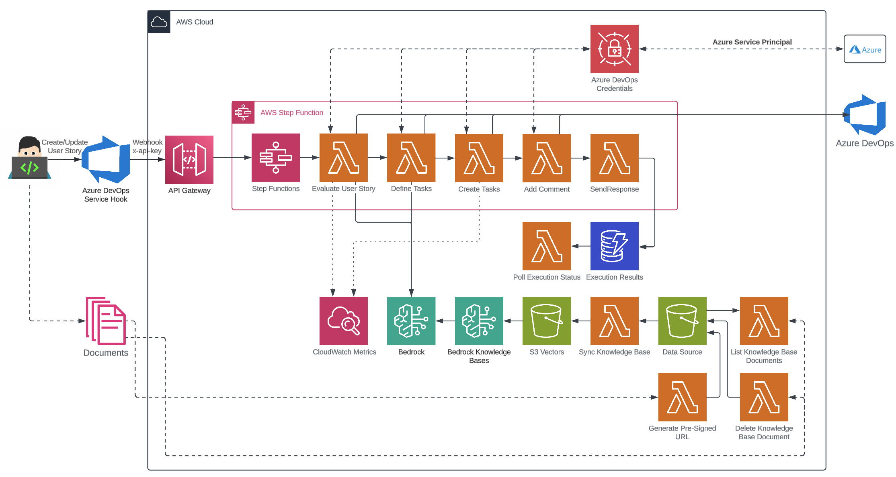

# Task Genie

<div align="center">
  
</div>

<div align="center">

<!-- Repository Stats -->

[](https://github.com/eric-bach/task-genie/issues)
[](https://github.com/eric-bach/task-genie/pulls)
[](https://github.com/eric-bach/task-genie/commits/main)
[](https://github.com/eric-bach/task-genie/releases)

<!-- Technology Stack -->

[](https://azure.microsoft.com/en-us/services/devops/)
[](https://typescriptlang.org/)
[](https://nextjs.org/)
[](https://nodejs.org/)

<!-- Project Status -->

[](LICENSE)
[](https://github.com/eric-bach/task-genie/stargazers)
[](https://github.com/eric-bach/task-genie/network/members)

</div>

<div align="center">
  <strong>An AI-powered assistant that integrates with Azure DevOps Boards to ensure user story completeness and automatically breaks them down into actionable tasks, streamlining the Agile process and enhancing developer productivity.</strong>
</div>

<br>

<div align="center">
  <a href="#features">Features</a> •
  <a href="#architecture">Architecture</a> •
  <a href="#getting-started">Getting Started</a> •
  <a href="#deployment">Deployment</a> •
  <a href="#pricing">Pricing</a> •
  <a href="#contributing">Contributing</a>
</div>

## ✨ Features

### 🔍 User Story Validation

- Ensures user stories follow best practices
- Identifies missing components in user stories
- Provides suggestions to improve clarity and completeness

### 📋 Task Breakdown

- Automatically decomposes validated user stories into smaller, actionable tasks
- Understands images within user stories as context in task breakdown process
- Uses RAG to support additional context like tech details, domain context, application knowledge, etc.
- Learns from user feedback on generated tasks to improve future task generation action using RAG
- Ability to fully customize the AI prompt for mutliple workflows

<div align="center">
  
</div>

### 🔗 Azure DevOps Boards Integration

- Multiple, seamless integration options with Azure DevOps Boards (Extension or Service Hooks)
- Automatically updates work items, tasks, and comments
- Built-in dashboards to visualize performance and effectiveness of task generation

<div align="center">
  
</div>

## 🏗️ Architecture

The architecture is deployed in AWS using a **serverless model** with **Step Functions** orchestrating the AI workflow. Integration with Azure DevOps is done through **Service Hooks** for each board.

<div align="center">
  
</div>

A state machine, leveraging **AWS Step Functions**, orchestrates the workflow for the interaction with the LLM.

<div align="center">
  
</div>

### 🛠️ Technology Stack

<div align="center">

|                                                              Technology                                                              |                  Description                   |
| :----------------------------------------------------------------------------------------------------------------------------------: | :--------------------------------------------: |
|           | **Amazon Web Services** - Cloud infrastructure |
|       |   **Next.js** - React framework for frontend   |
|     |      **ShadCN UI** - Modern UI components      |
|  | **Tailwind CSS** - Utility-first CSS framework |
|    |     **TypeScript** - Type-safe development     |

</div>

### ⚠️ Current Limitations

> **Azure DevOps Service Hooks Limitation**  
> Azure DevOps Service Hooks can only be configured to trigger on one or all fields when a work item is updated. When the Title, Description, and Acceptance Criteria of a work item are updated simultaneously, Task Genie will be triggered 3 times, resulting in 3x the number of tasks being generated.

> **Amazon Bedrock Knowledge Bases**  
> Task Genie uses S3 Vectors for the Knowledge Base Data Store, which is currently not supported in CloudFormation. The Bedrock Knowledge Base needs to be manually created in the console and the IDs need to be set in the `.env` file.

## 💰 Pricing

Estimated monthly costs (USD) for running in AWS:

<div align="center">

| Service                     | Rate (us-west-2)                      | Quantity | Estimated Cost |
| --------------------------- | ------------------------------------- | -------- | -------------- |
| CloudWatch                  | $3 per dashboard                      | 1        | $3.00          |
| Amplify                     | $0.01 per minute                      | 10       | $0.10          |
| Lambda                      | $0.0000166667 per GB-second           | 100,000  | $1.67          |
| Step Functions              | $0.00001667 per GB-second             | 100,000  | $1.67          |
| S3 Vectors (storage)        | $0.06 per GB                          | 1        | $0.06          |
| S3 Vectors (requests)       | $0.20 per GB                          | 1        | $0.20          |
| S3 Vectors (query requests) | $0.0025 per 1,000 requests            | 1,000    | $2.50          |
| Bedrock (Claude 4 Sonnet)   | $3.00/1M (input) / $15.00/1M (output) | 1        | $18.00         |
| **TOTAL (estimated)**       |                                       |          | **$27.20**     |

</div>

## 🚀 Getting Started

### 📋 Prerequisites (One-time setup)

1. **Azure Service Principal Setup**

   - Request the `Identity and Productivity Team` to create an Azure Service Principal in Azure DevOps with "Read & Write" permissions to "Work Items"
   - Use these values to populate the `.env` in the next step

2. **Azure DevOps User Configuration**

   - Log in to Azure DevOps → `Organization Settings` → `Users` → `Add users`
   - Enter the Service Principal Client Id and set the `Access Level` and `Project`
   - Uncheck `Send email invites`

   - Uncheck `Send email invites`

<div align="center">
  
</div>

## 🔧 Deployment

### 🚀 Backend Deployment Options

#### Option 1: Automated Deployment (GitHub Actions)

The backend is deployed using GitHub Actions with the following pipelines:

- **CI Pipeline** (`ci.yml`) - Runs on every pull request and push
  - Builds and tests the code
  - Validates CloudFormation templates
  - Runs security scans
- **Staging Deployment** (`deploy-staging.yml`) - Automatically deploys to staging on `main` branch pushes
- **Production Deployment** (`deploy-production.yml`) - Manual deployment only with confirmation

**One-time Setup for Automated Deployment:**

1. **Deploy GitHub Actions Infrastructure**

   The GitHub Actions OIDC provider and IAM role are automatically deployed when you run the deployment command:

   ```bash
   cd infrastructure
   npm run deploy
   ```

   This will deploy all stacks including:

   - AWS OIDC provider for GitHub Actions
   - IAM role with necessary permissions for CDK deployment
   - Your application infrastructure (data, app, observability stacks)
   - Output with the role ARN you'll need for GitHub

2. **Configure GitHub Repository**

   **Create Environments:**

   1. Go to your GitHub repository
   2. Navigate to **Settings** → **Environments**
   3. Create two environments: `staging` and `production`

   **Add Secrets:**
   For each environment, add the following secrets under **Settings** → **Secrets and variables** → **Actions**:

   **Required Secrets:**

   - `AZURE_DEVOPS_TENANT_ID`: Azure tenant ID
   - `AZURE_DEVOPS_CLIENT_ID`: Azure client ID
   - `AZURE_DEVOPS_CLIENT_SECRET`: Azure client secret
   - `AWS_BEDROCK_MODEL_ID`: Bedrock model ID

   **Environment-Specific Secrets:**
   For **staging** and **production** environments:

   - `AZURE_DEVOPS_ORGANIZATION`: Your Azure DevOps organization name
   - `AZURE_DEVOPS_SCOPE`: Azure DevOps scope
   - `AWS_ROLE_ARN`: AWS IAM role for Github Actions deployment
   - `AWS_BEDROCK_KNOWLEDGE_BASE_ID`: Amazon Bedrock Knowledge Base ID
   - `AWS_BEDROCK_KNOWLEDGE_BASE_DATA_SOURCE_ID`: Amazon Bedrock Knowledge Base Data Source ID
   - `AWS_CERTIFICATE_ARN`: ARN of the AWS Certificate used for the Docusarus Cloudfront Distribution
   - `DOCS_DOMAIN_NAME`: domain name of the Docusarus website
   - `FEEDBACK_FEATURE_ENABLED`: true or false to toggle Adapative Feedback feature

#### Option 2: Manual Deployment (CDK)

1. **Environment Configuration**

   Update the `/infrastructure/.env` file with your parameters:

   ```env
   AZURE_DEVOPS_ORGANIZATION=
   AZURE_DEVOPS_TENANT_ID=
   AZURE_DEVOPS_CLIENT_ID=
   AZURE_DEVOPS_CLIENT_SECRET=
   AZURE_DEVOPS_SCOPE=
   AWS_BEDROCK_MODEL_ID=
   AWS_BEDROCK_KNOWLEDGE_BASE_ID=
   AWS_BEDROCK_KNOWLEDGE_BASE_DATA_SOURCE_ID=
   AWS_CERTIFICATE_ARN=
   DOCS_DOMAIN_NAME=
   FEEDBACK_FEATURE_ENABLED=
   ```

2. **Install Dependencies**

   ```bash
   npm run install
   ```

3. **Deploy Infrastructure**

   ```bash
   npm run deploy
   npm run deploy-prod
   ```

   > ⚠️ **Note**: Amazon S3 Vectors for Bedrock Knowledge Bases is not yet supported in CloudFormation/CDK. The Bedrock Knowledge Base needs to be manually created in the AWS console.

4. **Create Bedrock Knowledge Base**

   - Set the Chunking strategy to `Semantic chunking` with `Max token size for a chunk` = 150

   <div align="center">
     
   </div>

   - Select `S3 Vectors` as the Data Source with the Knowledge Base Data Source Bucket from step 3

5. **Update Environment Variables**

   Update `/infrastructure/.env` with the created Bedrock Knowledge Base details:

   ```env
   AWS_BEDROCK_KNOWLEDGE_BASE_ID=your_kb_id
   AWS_BEDROCK_KNOWLEDGE_BASE_DATA_SOURCE_ID=your_data_source_id
   ```

6. **Re-deploy Backend**

   ```bash
   npm run deploy
   npm run deploy-prod
   ```

### 🌐 Frontend

The frontend is deployed using **AWS Amplify Console**.

#### Amplify Console

1. Create a new AWS Amplify project and point to this monorepo with `frontend` as the folder name.

2. Configure the environment variables in the project

   ```env
   NEXT_PUBLIC_COGNITO_USER_POOL_ID=
   NEXT_PUBLIC_COGNITO_CLIENT_ID=
   NEXT_PUBLIC_DOMAIN=
   NEXT_PUBLIC_REDIRECT_SIGNIN_URL=
   NEXT_PUBLIC_REDIRECT_SIGNOUT_URL=
   NEXT_PUBLIC_API_GATEWAY_URL=
   NEXT_PUBLIC_API_GATEWAY_API_KEY=
   ```

#### Local Development

1. **Environment Configuration**

   Update `/frontend/.env.local` with backend deployment parameters:

   ```env
   NEXT_PUBLIC_COGNITO_USER_POOL_ID=
   NEXT_PUBLIC_COGNITO_CLIENT_ID=
   NEXT_PUBLIC_DOMAIN=
   NEXT_PUBLIC_REDIRECT_SIGNIN_URL=http://localhost:3000/dashboard
   NEXT_PUBLIC_REDIRECT_SIGNOUT_URL=http://localhost:3000
   NEXT_PUBLIC_API_GATEWAY_URL=
   NEXT_PUBLIC_API_GATEWAY_API_KEY=
   ```

2. **Install Dependencies**

   ```bash
   npm run install
   ```

3. **Start Development Server**

   ```bash
   npm run dev
   ```

## ⚙️ Setup

### 🔗 Azure DevOps Configuration (ont-time, per board)

#### Option 1: Azure DevOps Extension

1. Install the [Task Genie](https://marketplace.visualstudio.com/items?itemName=AMA.task-genie) extension to the Azure DevOps organization

2. Add the extension to the Process template

   - Go to the [Organization Settings](https://amaabca.visualstudio.com/_settings) in Azure DevOps and click [Process](https://amaabca.visualstudio.com/_settings/process)
   - Click on the Process to edit
   - Click on `User Story`
   - Click `Add custom control` and select the ~Task Genie Button (AMA)`
     
   - Click `Options` and set the API URL and API Key to the values in the AWS environment
     

3. The `Generate Tasks` button should now appear on any User Stories using the Process
   

#### Option 2: Azure DevOps Service Hooks

The integration with Azure DevOps leverages **Service Hooks** and requires **4 Service Hooks** to be created for each Board:

- Work item created
- Work item updated (title)
- Work item updated (description)
- Work item updated (acceptance criteria)

<div align="center">
  
</div>

> ⚠️ **Important**: When the title, acceptance criteria, and description are updated simultaneously, it will trigger 3 times, resulting in 3x the number of tasks being generated. This is a limitation of Azure DevOps, not Task Genie.

1. **Access Project Settings**

   - In Azure DevOps project → Click the gear icon → `Project Settings`

2. **Navigate to Service Hooks**

   - Click on `Service hooks`

3. **Create New Service Hook**

   - Click the `+` plus sign to create a new Service Hook

4. **Configure Four Service Hooks**

   Create **four (4) Service Hooks** with the following configuration:

   | Setting                           | Value                                                                                                                          |
   | --------------------------------- | ------------------------------------------------------------------------------------------------------------------------------ |
   | **Trigger on this type of event** | work item created (1), work item updated (3)                                                                                   |
   | **Area path**                     | Azure DevOps project name                                                                                                      |
   | **Work item type**                | User Story                                                                                                                     |
   | **URL**                           | `https://API_GW_ID.execute-api.us-west-2.amazonaws.com/prod/executions` or `https://api.taskgenie.YOUR_DOMAIN.NAME/executions` |
   | **HTTP headers**                  | `x-api-key: <API_Gateway_API_Key>`                                                                                             |

#### Task Feedback

To setup the task feedback which will be used as supplemental information in the task generation process, setup three Azure DevOps Service Hooks:

- Work item created
- Work item updated
- Work item deleted
  

1. **Access Project Settings**

   - In Azure DevOps project → Click the gear icon → `Project Settings`

2. **Navigate to Service Hooks**

   - Click on `Service hooks`

3. **Create New Service Hook**

   - Click the `+` plus sign to create a new Service Hook

4. **Configure Three Service Hooks**

   Create **thress (3) Service Hooks** with the following configuration:

   | Setting                           | Value                                                                                                                                  |
   | --------------------------------- | -------------------------------------------------------------------------------------------------------------------------------------- |
   | **Trigger on this type of event** | work item created (1), work item updated (2)                                                                                           |
   | **Area path**                     | Azure DevOps project name                                                                                                              |
   | **Work item type**                | Task                                                                                                                                   |
   | **URL**                           | `https://API_GW_ID.execute-api.us-west-2.amazonaws.com/prod/feedback/track` or `https://api.taskgenie.YOUR_DOMAIN.NAME/feedback/track` |
   | **HTTP headers**                  | `x-api-key: <API_Gateway_API_Key>`                                                                                                     |

## 💻 Azure DevOps Extension

### Building the extension

1. To publish a new version of the Azure DevOps Extension

   `npx tfx-cli extension create --rev-version --output-path ./dist`

2. To test the Azure DevOps Extension

   `start test-standalone.html`

### Publishing the extension

1. Log on to the Azure DevOps Marketplace
   https://marketplace.visualstudio.com/

2. Create a publisher (one-time)
   https://marketplace.visualstudio.com/manage/createpublisher

3. Click `New Extension` -> `Azure DevOps` (one-time)

4. Upload the published extension

5. Click the 3 dots and then `Share` to share with the applicable ADO Organizations

## 📚 References

- [YouTube Demo](https://www.youtube.com/watch?v=POn5WYFw4xU)
- [AWS GenAI for DevOps Samples](https://github.com/aws-samples/genai-for-devops/tree/main/automating-kanban-workflows)

## 🤝 Contributing

We welcome contributions to Task Genie! Please feel free to submit issues, feature requests, or pull requests.

1. Fork the repository
2. Create a feature branch (`git checkout -b feature/amazing-feature`)
3. Commit your changes (`git commit -m 'Add some amazing feature'`)
4. Push to the branch (`git push origin feature/amazing-feature`)
5. Open a Pull Request

## 📄 License

This project is licensed under the MIT License - see the [LICENSE](LICENSE) file for details.

## 🆘 Support

If you encounter any issues or have questions, please:

1. Check the [Issues](https://github.com/eric-bach/task-genie/issues) page
2. Create a new issue if your problem isn't already reported
3. Provide detailed information about your environment and the issue

---

<div align="center">
  <strong>Made with ❤️ by the Task Genie Team</strong>
</div>
