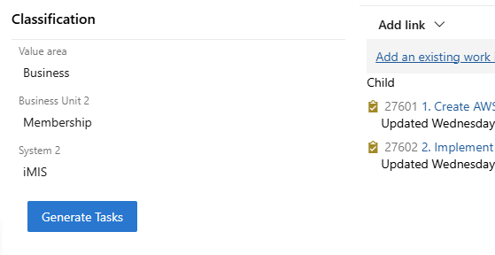

# Task Genie - AI-Powered User Story Assistant

Transform your Azure DevOps workflow with intelligent user story validation and automatic task generation.

## 🚀 What is Task Genie?

Task Genie is a powerful Azure DevOps extension that integrates AI capabilities directly into your Boards interface, helping teams create better user stories and automatically break them down into actionable tasks.

## ✨ Key Features

### 🔍 **Smart User Story Validation**

- **Quality Assurance**: Automatically validates user stories against Agile best practices
- **Completeness Check**: Ensures all necessary details are included before stories enter development
- **Real-time Feedback**: Provides instant suggestions for improving story quality

### 🤖 **AI-Powered Task Breakdown**

- **Intelligent Analysis**: Leverages advanced AI to understand story context and requirements
- **Automatic Generation**: Creates detailed, actionable tasks from user story descriptions
- **Consistent Format**: Ensures all generated tasks follow your team's standards and conventions

### ⚡ **Seamless Integration**

- **Native Experience**: Works directly within Azure DevOps Boards interface
- **No Context Switching**: Enhance your stories without leaving the platform
- **Easy Configuration**: Simple setup with API key configuration

### 🎯 **Productivity Benefits**

- **Faster Sprint Planning**: Reduce time spent breaking down stories into tasks
- **Improved Consistency**: Ensure uniform task creation across your team
- **Enhanced Quality**: Better-defined work items lead to more predictable delivery
- **Reduced Manual Effort**: Let AI handle the tedious work of task decomposition

## 🛠️ Getting Started

1. **Install the Extension**: Add Task Genie to your Azure DevOps organization
2. **Configure API Settings**: Set up your Task Genie API URL and key in the extension settings
3. **Start Creating**: Open any user story and use the Task Genie button to validate and generate tasks
4. **Customize**: Adjust settings to match your team's workflow and preferences

## 🏢 Perfect for Teams Who Want To:

- ✅ Improve user story quality and completeness
- ✅ Accelerate sprint planning and estimation
- ✅ Ensure consistent task breakdown across the team
- ✅ Leverage AI to enhance Agile processes
- ✅ Reduce manual effort in backlog management

## 📊 Supported Work Item Types

- User Stories
- Features
- Epics
- Custom work item types

## 🔐 Security & Privacy

Task Genie processes your work item data securely and does not store sensitive information. All AI processing is handled through secure, encrypted connections.

---

**Ready to transform your Agile workflow?** Install Task Genie today and experience the power of AI-assisted user story management in Azure DevOps.
