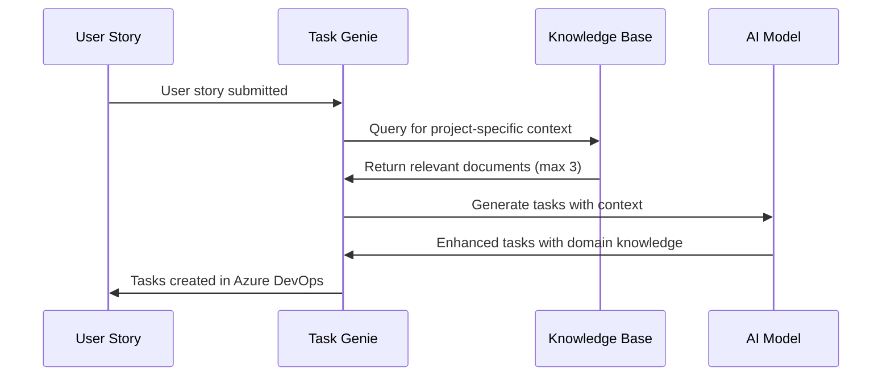

# Knowledge Base Configuration

Task Genie leverages Amazon Bedrock Knowledge Bases to enhance AI-powered task generation with organizational context. The system supports two distinct knowledge base types, each serving different purposes in the Agile workflow: **Project Scoped (Task Generation)** and **Agile Guided (User Story Evaluation)**.

## Overview of Knowledge Base Types

Task Genie uses Retrieval-Augmented Generation (RAG) to combine AI capabilities with your organization's specific knowledge, ensuring generated tasks and evaluations are contextually relevant and aligned with your team's practices.

| Knowledge Base Type                      | Purpose                                                    | Scope                 | When Applied                                |
| ---------------------------------------- | ---------------------------------------------------------- | --------------------- | ------------------------------------------- |
| **Project Scoped (Task Generation)**     | Enhance task breakdown with technical and business context | Team/Project specific | During task generation from user stories    |
| **Agile Guided (User Story Evaluation)** | Improve user story quality assessment                      | Organization-wide     | During user story evaluation and validation |

---

## Project Scoped Knowledge Base (Task Generation)

The Project Scoped Knowledge Base provides team-specific context to improve the quality and relevance of AI-generated tasks. Documents in this knowledge base are filtered and applied based on your Azure DevOps project structure.

### Purpose and Benefits

#### **Enhanced Task Generation**

- **Technical Context**: Architecture diagrams, API specifications, coding standards
- **Business Context**: Domain knowledge, business rules, workflow patterns
- **Team Practices**: Development methodologies, testing strategies, deployment procedures
- **System Knowledge**: Component relationships, dependencies, integration patterns

#### **Targeted Application**

Documents are automatically retrieved based on matching criteria:

- **Area Path**: Azure DevOps area path hierarchy
- **Business Unit**: Organizational division (e.g., "Engineering", "Product")
- **System**: Application or service identifier (e.g., "Customer Portal", "Payment Service")

### How Project Scoped Knowledge Works

#### **Document Filtering Process**

When generating tasks, Task Genie builds search filters based on the user story's metadata:

```javascript
// Example filtering logic
{
  "filter": {
    "andAll": [
      { "equals": { "key": "areaPath", "value": "MyProject\\Team Alpha" } },
      { "equals": { "key": "businessUnit", "value": "Engineering" } },
      { "equals": { "key": "system", "value": "Customer Portal" } }
    ]
  }
}
```

#### **Knowledge Retrieval Query**

The AI constructs context-aware queries to find relevant documentation:

```
Find relevant information to help with task breakdown (such as technical details,
application architecture, business context, etc.) for the following user story:
- Title: [User Story Title]
- Description: [User Story Description]
- Acceptance Criteria: [Acceptance Criteria]
```

#### **Integration with Task Generation**

Retrieved knowledge is seamlessly integrated into the AI prompt:

```
Here is additional context that you should consider:
- Architecture: The Customer Portal uses React frontend with Node.js backend...
- Business Rules: Payment processing must comply with PCI DSS standards...
- Testing Strategy: All API endpoints require unit tests and integration tests...
```

### Document Organization Structure

#### **Recommended Folder Hierarchy**

Organize your Project Scoped documents using this structure:

```
Knowledge Base/
├── [Business Unit]/
│   ├── [System]/
│   │   ├── technical-docs/
│   │   │   ├── api-specifications.md
│   │   │   ├── architecture-diagrams.pdf
│   │   │   └── database-schema.md
│   │   ├── business-rules/
│   │   │   ├── domain-logic.md
│   │   │   ├── workflow-patterns.md
│   │   │   └── compliance-requirements.md
│   │   └── team-practices/
│   │       ├── coding-standards.md
│   │       ├── testing-guidelines.md
│   │       └── deployment-procedures.md
```

#### **Metadata Requirements**

Each document must include proper metadata for filtering:

| Metadata Field | Description               | Example Values                                             |
| -------------- | ------------------------- | ---------------------------------------------------------- |
| `areaPath`     | Azure DevOps area path    | "MyProject\\Team Alpha", "Platform\\Infrastructure"        |
| `businessUnit` | Organizational unit       | "Engineering", "Product", "Operations"                     |
| `system`       | Target system/application | "Customer Portal", "Payment Service", "Analytics Platform" |

### Content Guidelines for Project Scoped Documents

#### **Technical Documentation**

**API Specifications:**

```markdown
# Customer API Endpoints

## Authentication

All endpoints require JWT token authentication...

## User Management Endpoints

- POST /api/users - Create new user
- GET /api/users/{id} - Retrieve user details
- PUT /api/users/{id} - Update user information

## Common Response Patterns

All API responses follow this structure:
{
"data": {},
"errors": [],
"meta": {}
}
```

**Architecture Patterns:**

```markdown
# Microservices Architecture

## Service Communication

- Synchronous: REST APIs for real-time operations
- Asynchronous: Event-driven messaging via AWS SQS
- Data Storage: Each service owns its database

## Cross-Cutting Concerns

- Authentication: Centralized via Auth Service
- Logging: Structured logging with CloudWatch
- Monitoring: Prometheus metrics + Grafana dashboards
```

#### **Business Context Documentation**

**Domain Rules:**

```markdown
# Payment Processing Rules

## Validation Requirements

- Credit card numbers must pass Luhn algorithm validation
- Transaction amounts cannot exceed $10,000 without approval
- International transactions require additional verification

## Compliance Standards

- PCI DSS Level 1 compliance required for card data
- GDPR compliance for EU customer data
- SOX compliance for financial reporting
```

**Workflow Patterns:**

```markdown
# User Registration Workflow

## Standard Flow

1. User submits registration form
2. System validates email format and password strength
3. Verification email sent to user
4. User clicks verification link
5. Account activated and welcome email sent

## Exception Handling

- Invalid email: Show inline error, keep form data
- Duplicate email: Offer password reset option
- Email delivery failure: Retry mechanism with exponential backoff
```

#### **Team Practices Documentation**

**Development Standards:**

```markdown
# Code Review Guidelines

## Required Checks

- [ ] All tests pass in CI/CD pipeline
- [ ] Code coverage maintains minimum 80%
- [ ] No security vulnerabilities detected
- [ ] Documentation updated for API changes

## Review Criteria

- Code follows established patterns and conventions
- Error handling is comprehensive and consistent
- Performance implications are considered
- Security best practices are followed
```

### Best Practices for Project Scoped Knowledge

#### **Document Quality**

1. **Keep Content Current**: Regular review and update cycles
2. **Use Clear Structure**: Consistent formatting and organization
3. **Include Examples**: Code samples, configuration examples, screenshots
4. **Cross-Reference**: Link related documents and external resources

#### **Metadata Consistency**

1. **Standardize Values**: Use consistent naming conventions for metadata
2. **Document Taxonomy**: Maintain a central registry of valid values
3. **Regular Audits**: Verify metadata accuracy and completeness
4. **Team Training**: Ensure all team members understand the structure

#### **Content Optimization**

1. **Chunk Appropriately**: Break large documents into focused sections
2. **Use Keywords**: Include terms developers commonly search for
3. **Avoid Duplication**: Reference centralized documents when possible
4. **Version Control**: Track document changes and maintain history

---

## Agile Guided Knowledge Base (User Story Evaluation)

The Agile Guided Knowledge Base provides organization-wide guidance for evaluating user story quality, ensuring consistency in Agile practices across all teams and projects.

### Purpose and Benefits

#### **User Story Quality Assessment**

- **Best Practices**: Agile methodology guidelines and standards
- **Template Examples**: Well-written user story templates and patterns
- **Common Patterns**: Effective acceptance criteria formats
- **Quality Criteria**: Evaluation rubrics and checklists

#### **Organization-Wide Consistency**

Unlike Project Scoped knowledge, Agile Guided documents apply to all user stories regardless of team, project, or system, ensuring consistent quality standards across your organization.

### How Agile Guided Knowledge Works

#### **Universal Application**

Agile Guided documents use a special filter that applies organization-wide:

```javascript
// Agile Guided filter configuration
{
  "filter": {
    "equals": {
      "key": "areaPath",
      "value": "agile-process"
    }
  }
}
```

#### **Evaluation Query Construction**

The AI searches for process guidance using targeted queries:

```
Find relevant information about the user story process and guidelines that would
help evaluate the following user story is well-defined:
- Title: [User Story Title]
- Description: [User Story Description]
- Acceptance Criteria: [Acceptance Criteria]
```

#### **Integration with Story Evaluation**

Retrieved guidance enhances the evaluation process:

```
Additional business or domain context from knowledge base:
- User Story Best Practices: Stories should follow the "As a... I want... So that..." format
- Acceptance Criteria Standards: Use Given/When/Then format for testable scenarios
- Definition of Ready: All stories must include persona, rationale, and clear criteria
```

### Document Organization for Agile Guided Knowledge

#### **Required Metadata**

All Agile Guided documents must use this specific metadata:

```javascript
{
  "areaPath": "agile-process",
  "businessUnit": "agile",
  "system": "process"
}
```

#### **Content Categories**

Organize Agile Guided content into these categories:

```
Agile Process Knowledge/
├── user-story-standards/
│   ├── story-template-guidelines.md
│   ├── acceptance-criteria-formats.md
│   └── persona-definitions.md
├── quality-criteria/
│   ├── definition-of-ready.md
│   ├── story-evaluation-rubric.md
│   └── common-anti-patterns.md
├── process-guidelines/
│   ├── sprint-planning-best-practices.md
│   ├── backlog-refinement-process.md
│   └── estimation-techniques.md
└── templates-examples/
    ├── epic-breakdown-examples.md
    ├── well-written-story-samples.md
    └── acceptance-criteria-templates.md
```

### Content Guidelines for Agile Guided Documents

#### **User Story Standards**

**Story Template Guidelines:**

```markdown
# User Story Format Standards

## Standard Template

"As a [persona], I want [goal] so that [benefit/rationale]"

## Examples by Persona Type

### End User Stories

- As a customer, I want to reset my password so that I can regain access to my account
- As a mobile user, I want to save my shopping cart so that I can complete my purchase later

### System Integration Stories

- As a payment processor, I want to receive order notifications so that I can process transactions
- As an analytics system, I want to track user events so that I can provide usage insights

### Administrative Stories

- As a system administrator, I want to monitor application health so that I can proactively address issues
```

**Acceptance Criteria Formats:**

```markdown
# Acceptance Criteria Best Practices

## Given/When/Then Format

**Structure:**

- Given [initial context/state]
- When [action/event occurs]
- Then [expected outcome]

**Example:**
Given I am a logged-in customer with items in my cart
When I proceed to checkout and enter valid payment information
Then my order is processed successfully and I receive a confirmation email

## Scenario-Based Format

**Structure:**

1. **Scenario:** [Brief description]
2. **Acceptance Criteria:**
   - [ ] Criteria 1
   - [ ] Criteria 2
   - [ ] Criteria 3

**Example:**
**Scenario:** Password reset for existing user
**Acceptance Criteria:**

- [ ] User can request password reset via email
- [ ] Reset link expires after 24 hours
- [ ] Password must meet complexity requirements
- [ ] User receives confirmation after successful reset
```

#### **Quality Assessment Guidelines**

**Definition of Ready:**

```markdown
# User Story Definition of Ready

## Required Elements

- [ ] **User Persona**: Clearly identified user type or system
- [ ] **Goal**: Specific functionality or outcome desired
- [ ] **Business Value**: Rationale explaining why this matters
- [ ] **Acceptance Criteria**: Testable conditions for completion
- [ ] **Dependencies**: Known blockers or prerequisite work identified
- [ ] **Estimation**: Story points or effort estimate assigned

## Quality Indicators

- [ ] Story is independent and can be developed in isolation
- [ ] Scope is appropriate for one sprint iteration
- [ ] Requirements are clear without need for clarification
- [ ] Success criteria are objectively measurable
- [ ] Technical approach is feasible with current architecture
```

**Evaluation Rubric:**

```markdown
# Story Quality Assessment Rubric

## Excellent (5 points)

- Clear persona with specific context and motivation
- Detailed acceptance criteria with edge cases covered
- Business value explicitly stated and compelling
- Appropriate scope for single sprint completion
- No ambiguous language or undefined terms

## Good (4 points)

- Identifiable persona and clear goal
- Adequate acceptance criteria covering main scenarios
- Business value implied or briefly stated
- Reasonable scope with minor clarifications needed
- Mostly clear with minimal ambiguity

## Needs Improvement (2-3 points)

- Generic persona or unclear user context
- Basic acceptance criteria missing important scenarios
- Business value unclear or missing
- Scope too large or poorly defined
- Significant ambiguity requiring discussion

## Inadequate (1 point)

- Missing or unclear persona
- Vague or missing acceptance criteria
- No clear business value
- Scope inappropriate for agile development
- Extensive clarification required
```

#### **Anti-Pattern Recognition**

**Common Story Problems:**

```markdown
# User Story Anti-Patterns to Avoid

## The "As a Developer" Anti-Pattern

❌ **Wrong:** "As a developer, I want to refactor the authentication module so that code is cleaner"
✅ **Right:** "As a customer, I want faster login response times so that I can access my account quickly"

## The Technical Task Disguised as Story

❌ **Wrong:** "As a user, I want the database to be optimized so that queries run faster"  
✅ **Right:** "As a customer, I want search results to load in under 2 seconds so that I can find products efficiently"

## The Epic Masquerading as Story

❌ **Wrong:** "As a customer, I want a complete e-commerce platform so that I can shop online"
✅ **Right:** "As a customer, I want to add items to my shopping cart so that I can purchase multiple products at once"

## Vague Acceptance Criteria

❌ **Wrong:** "The system should work properly and be user-friendly"
✅ **Right:** "Login succeeds within 3 seconds with valid credentials and displays helpful error messages for invalid attempts"
```

### Best Practices for Agile Guided Knowledge

#### **Content Governance**

1. **Central Ownership**: Designate Scrum Masters or Agile Coaches as content owners
2. **Regular Reviews**: Quarterly assessment and updates of process documentation
3. **Stakeholder Input**: Gather feedback from teams using the evaluation system
4. **Continuous Improvement**: Evolve standards based on team maturity and lessons learned

#### **Quality Assurance**

1. **Peer Review**: Have multiple Agile practitioners review content changes
2. **Practical Testing**: Validate guidelines against real user stories
3. **Feedback Integration**: Incorporate insights from story evaluation results
4. **Training Alignment**: Ensure content aligns with organizational Agile training

#### **Measurement and Optimization**

1. **Quality Metrics**: Track story quality improvements over time
2. **Evaluation Accuracy**: Monitor how well AI assessments match human reviews
3. **Usage Analytics**: Identify which guidelines are most/least effective
4. **Team Adoption**: Measure consistency of story quality across teams

---

## Knowledge Base Management

### Document Upload and Synchronization

#### **Upload Process**

1. **Access Knowledge Base Interface**

   - Navigate to Task Genie web interface
   - Go to **Knowledge Base** section
   - Choose appropriate knowledge base type

2. **Select Knowledge Base Type**

   - **Project Scoped (Task Generation)**: For team-specific technical/business context
   - **Agile Guided (User Story Evaluation)**: For organization-wide process guidance

3. **Configure Metadata**

   - **Project Scoped**: Set Area Path, Business Unit, and System
   - **Agile Guided**: Use predefined "agile-process" metadata

4. **Upload Documents**
   - Support for `.md`, `.txt`, `.pdf`, `.docx`, `.json` files
   - Maximum file size: 5MB per document
   - Automatic text extraction and chunking

#### **Synchronization Process**

After upload, documents undergo automatic processing:

1. **Text Extraction**: Content extracted from various file formats
2. **Semantic Chunking**: Documents split into 150-token chunks with overlap
3. **Vector Embedding**: Text converted to vector representations for similarity search
4. **Index Integration**: Chunks added to searchable knowledge base index
5. **Metadata Tagging**: Filter metadata applied for targeted retrieval

### Supported File Types and Best Practices

#### **File Format Guidelines**

| File Type          | Best For                           | Optimization Tips                             |
| ------------------ | ---------------------------------- | --------------------------------------------- |
| **Markdown (.md)** | Technical documentation, processes | Use clear headers, bullet points, code blocks |
| **Text (.txt)**    | Simple guidelines, checklists      | Keep formatting minimal but structured        |
| **PDF (.pdf)**     | Formal documents, diagrams         | Ensure text is selectable, not image-based    |
| **Word (.docx)**   | Business documents, templates      | Use styles for consistent formatting          |
| **JSON (.json)**   | API specs, configuration examples  | Include comments and clear structure          |

#### **Content Optimization**

**Effective Knowledge Base Content:**

- **Clear Structure**: Use headers, bullets, and numbered lists
- **Specific Examples**: Include code samples, templates, real scenarios
- **Actionable Information**: Focus on "how-to" rather than theoretical concepts
- **Current Information**: Regular updates to maintain accuracy
- **Searchable Keywords**: Use terms developers and PMs actually search for

**Content to Avoid:**

- **Outdated Information**: Remove or update deprecated practices
- **Sensitive Data**: No credentials, personal info, or confidential details
- **Duplicate Content**: Avoid redundancy across multiple documents
- **Overly Generic Advice**: Focus on organization-specific guidance

### Monitoring and Analytics

#### **Usage Metrics**

Track knowledge base effectiveness through:

1. **Retrieval Success Rate**: How often relevant documents are found
2. **Task Quality Improvement**: Compare generated tasks before/after knowledge base
3. **Story Evaluation Accuracy**: Measure consistency with human assessments
4. **Document Utilization**: Identify most/least referenced content

#### **Performance Optimization**

1. **Regular Content Audits**: Review and refresh outdated documents
2. **Metadata Refinement**: Improve filtering accuracy based on usage patterns
3. **Chunk Size Optimization**: Adjust document chunking for better retrieval
4. **Query Enhancement**: Refine search queries based on effectiveness

---

## Integration with Task Generation Workflow

### Automatic Knowledge Retrieval

#### **Task Generation Flow with Knowledge Base**



#### **Context Enhancement Example**

**Without Knowledge Base:**

```
Generate tasks for: "As a customer, I want to update my profile information"

Tasks Generated:
1. Create profile update API endpoint
2. Build profile edit form UI
3. Add form validation
4. Test the functionality
```

**With Project Scoped Knowledge Base:**

```
Generate tasks for: "As a customer, I want to update my profile information"

Additional Context from Knowledge Base:
- API follows REST conventions with PUT /api/users/{id}
- UI uses React with Formik for form handling
- Validation includes email format, phone number patterns
- Testing requires unit tests and Cypress E2E tests

Enhanced Tasks Generated:
1. Implement PUT /api/users/{id} endpoint following REST API standards
2. Create React profile form component using Formik with proper error handling
3. Add server-side validation for email format and phone number patterns
4. Write unit tests for API endpoint and form validation logic
5. Create Cypress E2E test for complete profile update workflow
6. Update API documentation with new endpoint specifications
```

### Quality Assurance Integration

#### **Story Evaluation with Agile Guidance**

**Without Knowledge Base:**

```
Evaluate: "As a user, I want better performance"

Assessment: FAIL - Story lacks specific persona, clear goal, and measurable criteria
```

**With Agile Guided Knowledge Base:**

```
Evaluate: "As a user, I want better performance"

Guidance from Knowledge Base:
- Stories should specify concrete user persona (customer, admin, etc.)
- Performance requirements need quantifiable metrics (load time, throughput)
- Business value should explain impact on user experience

Enhanced Assessment:
FAIL - Story needs improvement:
- Replace generic "user" with specific persona like "mobile customer"
- Define "better performance" with measurable criteria (e.g., "page loads in <2 seconds")
- Add business rationale explaining why performance matters to users
```

---

## Troubleshooting and Optimization

### Common Issues and Solutions

#### **Documents Not Retrieved**

**Problem:** Knowledge base documents aren't being used in task generation.

**Diagnosis Steps:**

1. Verify document metadata matches work item attributes
2. Check knowledge base synchronization status
3. Review query construction and filtering logic
4. Confirm document content relevance to search query

**Solutions:**

- Update document metadata to match Azure DevOps structure
- Resync knowledge base after metadata changes
- Refine document content with more specific keywords
- Split large documents into focused, searchable chunks

#### **Poor Task Quality Despite Knowledge Base**

**Problem:** Generated tasks don't reflect uploaded knowledge.

**Diagnosis Steps:**

1. Review retrieved documents in generation logs
2. Assess document content quality and specificity
3. Check for conflicting or outdated information
4. Evaluate chunk size and content organization

**Solutions:**

- Improve document structure and clarity
- Remove outdated or conflicting content
- Add more specific examples and guidelines
- Optimize chunk size for better context retrieval

#### **Inconsistent Story Evaluations**

**Problem:** Story quality assessments vary unexpectedly.

**Diagnosis Steps:**

1. Review Agile Guided knowledge base content
2. Check for ambiguous or contradictory guidelines
3. Verify universal application of evaluation criteria
4. Compare AI assessments with human reviews

**Solutions:**

- Standardize evaluation criteria and language
- Remove ambiguous or subjective guidance
- Add more specific examples and counter-examples
- Regular calibration against human expert assessments

### Performance Optimization

#### **Retrieval Efficiency**

1. **Optimize Metadata**: Use consistent, specific values for better filtering
2. **Content Quality**: Focus on actionable, specific information
3. **Document Size**: Balance detail with retrievability (aim for 500-2000 words per document)
4. **Regular Cleanup**: Remove outdated or duplicate content

#### **Integration Performance**

1. **Monitor Latency**: Track knowledge retrieval time impact on overall generation
2. **Batch Processing**: Consider async processing for large knowledge bases
3. **Caching Strategy**: Implement caching for frequently accessed content
4. **Incremental Updates**: Use incremental sync for knowledge base updates

---

## Next Steps

After configuring your knowledge bases:

1. **[Custom Prompts](./prompt_overrides.md)** - Enhance prompts with knowledge base references
2. **[Team Collaboration](../guides/team-collaboration.md)** - Share knowledge management practices
3. **[Analytics & Monitoring](../guides/analytics.md)** - Track knowledge base effectiveness

Ready to enhance Task Genie with your organization's knowledge? Start by identifying your most valuable documentation and organizing it into Project Scoped and Agile Guided categories!
