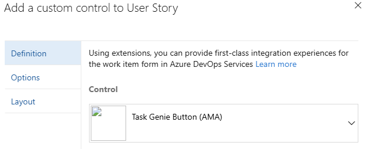
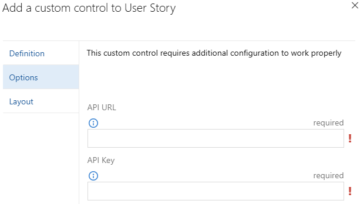

# Installation & Setup

**Task Genie** offers two methods for integration with Azure DevOps, each designed to meet different organizational needs and preferences. Choose the method that best fits your team's workflow and administrative requirements.

---

## Azure DevOps Extension

The [Task Genie Azure DevOps Extension](https://marketplace.visualstudio.com/items?itemName=AMA.task-genie) provides the quickest and most user-friendly way to get started with Task Genie. It adds a `Generate Tasks` button directly to your User Story work item forms that can be used to trigger **Task Genie**. The extension can also be installed on Epic and Feature work item forms.

### Prerequisites

Before installing the extension, ensure you have:

- **Azure DevOps Project Access**: Write permissions to work items in your project
- **Extension Installation Rights**: Ability to install extensions in your Azure DevOps organization
- **Task Genie API Access**: API endpoint URL and API key from your **Task Genie** deployment

### Installation Steps

#### Step 1: Install the Extension

1. **Access Azure DevOps Marketplace**
   - Navigate to the [Azure DevOps Marketplace](https://marketplace.visualstudio.com/)
   - Search for "Task Genie" or contact your administrator for the extension package

2. **Install in Your Organization**
   - Click "Get it free" or "Install"
   - Select your Azure DevOps organization
   - Choose the projects where you want to install Task Genie
   - Complete the installation process

#### Step 2: Add Control to Work Item Forms

1. **Customize Work Item Process**
   - Go to **Organization Settings** → **Process**
   - Select your process template (Agile, Scrum, etc.)

2. **Edit User Story Work Item Type**
   - Click on **User Story** work item type
   - Navigate to **Layout** tab

3. **Add Task Genie Control**
   - Click **Add a custom control**
   - Select "Task Genie Button" from the list
     
   - Configure the control settings:
     - **Label**: "Task Genie"
     - **API URL**: Reference your configured API endpoint
     - **API Key**: Reference your configured API key
   - Save the changes

   - Click `Options` and set the API URL and API Key to the values in the AWS environment
     

4. The `Generate Tasks` button should now appear on any User Stories using the Process
   

### Using the Extension

Once installed and configured:

1. **Open a User Story**
   - Navigate to any User Story work item in your project
   - The "Generate Tasks" button will appear in the work item form

2. **Generate Tasks**
   - Click the **Generate Tasks** button
   - Task Genie will analyze your user story
   - Generated tasks will be automatically created and linked to your story

3. **Review Generated Tasks**
   - Check the **Related Work** section for newly created tasks
   - Review and modify tasks as needed
   - Tasks are ready for sprint planning and assignment

### Troubleshooting Extension Issues

**Button Not Appearing?**

- Verify the extension is installed for your project
- Check that the control was added to the User Story layout
- Ensure you have proper permissions to view custom controls

**API Connection Issues?**

- Verify the API URL is correct and accessible
- Check that the API key is valid and has proper permissions
- Review browser developer tools for network errors

---

---

## Next Steps

After completing installation:

1. **[Configure Your Knowledge Base](./knowledge-base-setup.md)** - Enhance AI responses with organizational context
2. **[Customize Task Templates](./customization.md)** - Tailor task generation to your team's needs
3. **[Monitor and Analytics](./monitoring.md)** - Track performance and optimize your workflow

Choose the method that best fits your organization's needs and start transforming your Agile workflow with AI-powered task generation!
