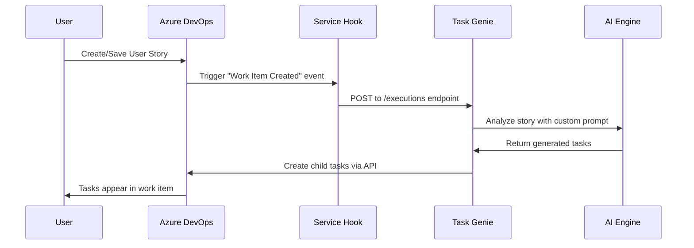

# Working with Azure DevOps User Stories

This guide explains how Task Genie integrates with Azure DevOps User Stories to automatically or manually generate development tasks. Task Genie offers two primary workflows depending on your setup: **automatic processing via Service Hooks** or **on-demand generation via the Azure DevOps Extension**.

## Overview of User Story Workflows

| Workflow Type                 | Trigger                             | When It Happens                  | Best For                          |
| ----------------------------- | ----------------------------------- | -------------------------------- | --------------------------------- |
| **Service Hooks (Automatic)** | Work item creation/update           | Real-time when stories are saved | Teams wanting seamless automation |
| **Extension (Manual)**        | User clicks "Generate Tasks" button | On-demand when user chooses      | Teams wanting control over timing |

---

## Creating a New User Story

### Automatic Workflow (Service Hooks)

When you create a new User Story in Azure DevOps with Service Hooks configured, Task Genie automatically processes the story.

#### **Step 1: Create the User Story**

1. **Navigate to Azure DevOps Boards**

   - Open your Azure DevOps project
   - Go to **Boards** → **Work Items**
   - Click **New Work Item** → **User Story**

2. **Fill in Required Fields**

   Fill in these essential fields for optimal Task Genie results:

   ```
   Title: As a [user type], I want to [goal] so that [benefit]

   Description: Detailed explanation of the feature including:
   - Business context and rationale
   - User personas and scenarios
   - Technical considerations
   - Dependencies and constraints

   Acceptance Criteria: Clear, testable criteria such as:
   - Given [context]
   - When [action]
   - Then [expected result]

   Area Path: Select your team's area path
   Custom.BusinessUnit2: Your business unit (e.g., "Engineering")
   Custom.System2: Target system (e.g., "Customer Portal")
   ```

3. **Save the User Story**
   - Click **Save & Close** or **Save**
   - Task Genie Service Hook triggers automatically

#### **Step 2: Automatic Task Generation**

Once saved, Task Genie processes the User Story through this workflow:



#### **Step 3: Review Generated Tasks**

After processing (typically 30-60 seconds):

1. **Check the Related Work section** in your User Story
2. **Review generated tasks** for completeness and accuracy
3. **Modify tasks** as needed for your team's specific requirements
4. **Assign tasks** to team members for sprint planning

#### **What Gets Generated**

Task Genie typically creates 3-7 tasks including:

- **Development Tasks**: Frontend/backend implementation
- **Testing Tasks**: Unit tests, integration tests, E2E tests
- **Documentation Tasks**: API docs, user guides, technical specs
- **Review Tasks**: Code review, security review, performance review
- **Deployment Tasks**: Environment setup, deployment scripts

### Manual Workflow (Extension)

With the Azure DevOps Extension installed, you have full control over when Task Genie processes your stories.

#### **Step 1: Create the User Story**

Follow the same process as above to create and save your User Story with all required fields.

#### **Step 2: Manual Task Generation**

1. **Open the User Story**

   - Navigate to your saved User Story
   - The Task Genie button appears in the work item form

2. **Click "Generate Tasks"**

   - Click the **Generate Tasks** button
   - Task Genie processes the story immediately
   - A status message shows processing progress

3. **Monitor Processing**
   - Watch for status updates in the button area
   - Processing typically takes 30-60 seconds
   - Success/error messages appear when complete

#### **Benefits of Manual Workflow**

- **Timing Control**: Generate tasks when story is fully refined
- **Selective Processing**: Only process stories that need task breakdown
- **Iterative Refinement**: Regenerate tasks after story updates
- **Review Before Generation**: Ensure story quality before task creation

---

## Updating an Existing User Story

### Automatic Updates (Service Hooks)

When Service Hooks are configured, Task Genie responds to specific field updates:

#### **Triggering Fields**

Task Genie automatically processes updates to these fields:

| Field                   | Service Hook                              | Impact                                        |
| ----------------------- | ----------------------------------------- | --------------------------------------------- |
| **Title**               | "Work item updated (Title)"               | Re-analyzes story context and scope           |
| **Description**         | "Work item updated (Description)"         | Updates task details based on new information |
| **Acceptance Criteria** | "Work item updated (Acceptance Criteria)" | Refines task requirements and test scenarios  |

#### **Update Workflow**

1. **Edit the User Story**

   - Open your existing User Story
   - Modify Title, Description, or Acceptance Criteria
   - Save your changes

2. **Automatic Processing**

   - Service Hook triggers for each modified field
   - Task Genie analyzes the updated story
   - New tasks are generated and linked to the story

3. **Review Updated Tasks**
   - Check for newly created tasks
   - Review how updates affected task generation
   - Remove or modify duplicate tasks if needed

:::warning Multiple Triggers
If you update Title, Description, and Acceptance Criteria simultaneously, Azure DevOps will trigger 3 separate Service Hooks, potentially creating 3x the number of tasks. This is a limitation of Azure DevOps Service Hooks, not Task Genie.

**Workaround**: Update fields one at a time, or use the Extension workflow for better control.
:::

### Manual Updates (Extension)

With the Extension workflow, you control when updates are processed:

#### **Update Process**

1. **Edit Your User Story**

   - Make all desired changes to Title, Description, Acceptance Criteria
   - Save your changes

2. **Regenerate Tasks When Ready**
   - Click the **Generate Tasks** button
   - Task Genie processes the updated story
   - New tasks are created based on current story state

#### **Best Practices for Updates**

- **Complete Your Edits First**: Make all changes before regenerating tasks
- **Review Existing Tasks**: Check if current tasks still align with updated story
- **Clean Up Duplicates**: Remove obsolete tasks before generating new ones
- **Preserve Work**: Consider task history and work already completed

---

## Task Genie Tag System

Task Genie uses a tagging system to track and organize generated tasks, making it easy to identify AI-generated work items and manage the task generation lifecycle.

### Automatic Tagging

#### **Standard Tags Applied**

Task Genie automatically applies these tags to generated tasks:

| Tag               | Purpose                         | Applied To               |
| ----------------- | ------------------------------- | ------------------------ |
| `task-genie`      | Identifies AI-generated tasks   | All generated tasks      |
| `auto-generated`  | Distinguishes from manual tasks | All generated tasks      |
| `v{version}`      | Tracks generation iteration     | Tasks from story updates |
| `{business-unit}` | Organizational grouping         | Team-specific tasks      |
| `{system}`        | System/application context      | System-specific tasks    |

#### **Example Tag Configuration**

```
Tags: task-genie, auto-generated, v1, engineering, customer-portal
```

### Tag-Based Management

#### **Filtering and Queries**

Use tags to create useful Azure DevOps queries:

**Find All Task Genie Tasks:**

```
Tags Contains "task-genie"
```

**Find Tasks by System:**

```
Tags Contains "customer-portal" AND Tags Contains "task-genie"
```

**Find Latest Task Generation:**

```
Tags Contains "v2" AND Tags Contains "task-genie"
```

#### **Bulk Operations**

Tags enable efficient bulk operations:

1. **Bulk Assignment**: Select all tasks with specific tags
2. **Progress Tracking**: Monitor completion of AI-generated tasks
3. **Cleanup Operations**: Remove obsolete task generations
4. **Reporting**: Analyze task generation effectiveness

### Custom Tagging Strategy

#### **Team-Specific Tags**

Configure additional tags in your custom prompts:

```
Add these tags to generated tasks:
- sprint-{number}: Current sprint identifier
- priority-{level}: Task priority level
- component-{name}: System component affected
- effort-{size}: Estimated effort (S/M/L/XL)
```

#### **Integration with Azure DevOps**

Tags integrate seamlessly with Azure DevOps features:

- **Board Filtering**: Filter Kanban boards by Task Genie tags
- **Dashboard Widgets**: Create widgets showing AI-generated task progress
- **Analytics**: Track velocity and completion rates for generated tasks
- **Automation Rules**: Create rules based on tag combinations

---

## Workflow Best Practices

### For Service Hooks (Automatic)

#### **Story Creation Guidelines**

1. **Complete Stories First**: Fill in all required fields before saving
2. **Use Templates**: Create User Story templates with proper structure
3. **Batch Updates Carefully**: Avoid simultaneous field updates when possible
4. **Monitor Processing**: Check for successful task generation

#### **Managing Automatic Generation**

1. **Review Quickly**: Check generated tasks soon after creation
2. **Clean Up Promptly**: Remove duplicate or incorrect tasks immediately
3. **Refine Prompts**: Improve custom prompts based on task quality
4. **Monitor Volume**: Track API usage and task generation frequency

### For Extension (Manual)

#### **Strategic Generation**

1. **Refine Before Generation**: Ensure story quality before clicking generate
2. **Iterative Improvement**: Regenerate after story refinements
3. **Selective Processing**: Only generate tasks for stories needing breakdown
4. **Team Coordination**: Coordinate generation timing with team activities

#### **Quality Control**

1. **Review Before Generation**: Validate story completeness
2. **Customize Context**: Ensure business unit and system fields are accurate
3. **Post-Generation Review**: Thoroughly review and refine generated tasks
4. **Team Feedback**: Gather team input on task quality and usefulness

### Cross-Workflow Considerations

#### **Switching Between Workflows**

If you have both Service Hooks and Extension configured:

1. **Disable Service Hooks**: Temporarily disable hooks for manual control
2. **Use Extension Override**: Extension generation can supplement automatic tasks
3. **Coordinate Timing**: Avoid simultaneous automatic and manual generation
4. **Monitor Duplicates**: Watch for duplicate task creation

#### **Team Training**

1. **Workflow Training**: Ensure team understands chosen workflow
2. **Quality Standards**: Establish standards for User Story completeness
3. **Task Review Process**: Define how team reviews and refines generated tasks
4. **Feedback Loop**: Create process for improving prompts and configuration

---

## Troubleshooting Common Issues

### Service Hooks Issues

**Tasks Not Generated Automatically**

- Verify Service Hooks are properly configured and active
- Check Service Hook activity logs for errors
- Ensure User Story has all required fields populated
- Confirm API Gateway and authentication are working

**Duplicate Tasks Generated**

- Review which Service Hooks are triggering simultaneously
- Consider updating fields one at a time
- Implement task cleanup procedures
- Switch to Extension workflow for better control

### Extension Issues

**Generate Tasks Button Not Appearing**

- Verify extension is installed and configured
- Check that custom control is added to User Story layout
- Ensure proper permissions for extension usage
- Confirm API URL and API Key are configured correctly

**Button Click Not Working**

- Check browser developer tools for JavaScript errors
- Verify API connectivity and authentication
- Ensure User Story has required custom fields
- Review extension configuration parameters

### General Quality Issues

**Poor Task Quality**

- Review and refine custom prompt templates
- Ensure User Stories follow best practices
- Add more context to story descriptions
- Upload relevant documentation to knowledge base

**Tasks Don't Match Team Practices**

- Customize prompts for your development methodology
- Include team-specific coding standards in prompts
- Add technical context to knowledge base
- Iterate on prompt design based on team feedback

---

## Next Steps

After mastering User Story workflows with Task Genie:

2. **[Knowledge Base Management](./knowledge-base.md)** - Upload team-specific documentation
3. **[Analytics & Reporting](./analytics.md)** - Track task generation effectiveness

Ready to streamline your User Story workflow? Choose the integration method that best fits your team's needs and start generating high-quality development tasks automatically!
