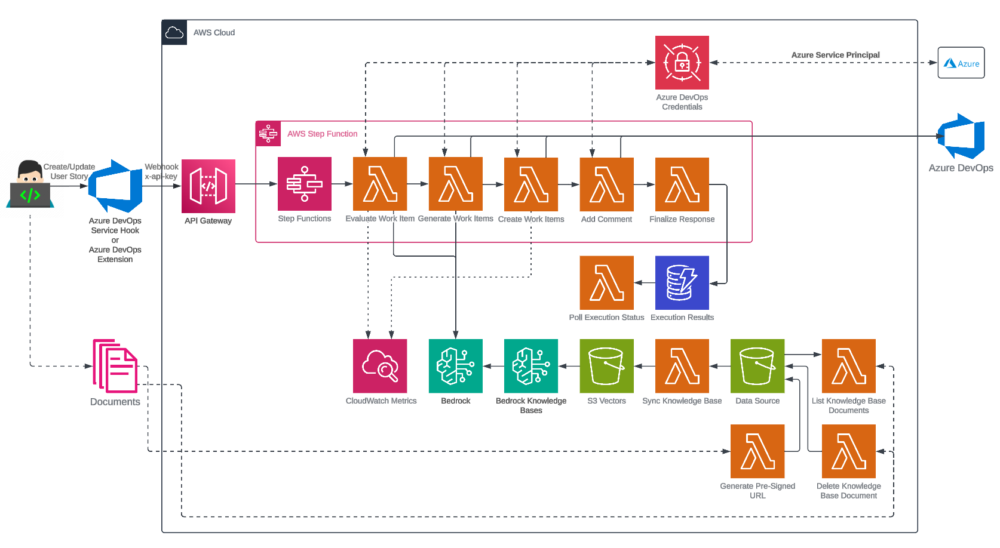
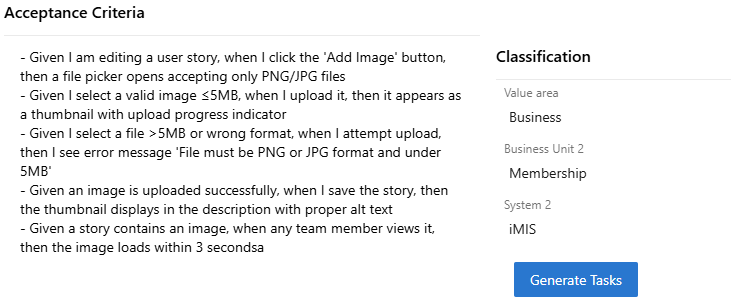

# Introduction

Welcome to **Task Genie** - an AI-powered assistant that combines the power of AI with Azure DevOps integration to solve common challenges in the Agile process to improve feature breakdown, sprint planning, and story management.

## What is Task Genie?

**Task Genie** integrates with **Azure DevOps Boards** and uses the most advanced foundation models to ensure epics, features, and user stories are well-defined and automatically breaks them down into actionable work items, streamlining the Agile process and enhancing developer productivity.

By leveraging Retrieval-Augmented Generation (RAG) and providing prompt customization, **Task Genie** can be tailored to any Agile use case. See the **Configuration** section for more details.

## Key Problems Task Genie Solves

### 🎯 **Incomplete Work Items**

Many epics, features, and user stories lack essential components like clear descriptions, success criteria, proper context, or technical details. **Task Genie** validates your work items against Agile best practices and identifies missing elements.

### 📋 **Manual Work Item Breakdown**

Breaking down epics, features, and user stories into actionable work items is time-consuming and often inconsistent. **Task Genie** automates this process while maintaining alignment with Agile methodologies.

### 🔄 **Context Loss**

Teams often lose important domain knowledge and technical context when creating tasks. Task Genie uses RAG to incorporate relevant organizational knowledge, technical documentation, and domain-specific information.

### 📊 **Workflow Inefficiencies**

Without proper insights into story quality and task generation patterns, teams struggle to improve their processes. Task Genie provides analytics to optimize your workflow.

## How Task Genie Works

**Task Genie** operates through a serverless architecture on AWS, orchestrated by Step Functions, and with Amazon Bedrock for reliable and scalable AI processing:

### 🔍 **Work Item Evalutation Agent**

1. **Automated Analysis**: When a epic, feature, or user story is created or updated in Azure DevOps, Task Genie automatically analyzes its completeness
2. **Best Practice Validation**: Checks for essential components like user personas, acceptance criteria, and clear descriptions
3. **Contextual Enhancement**: Uses organizational knowledge base to identify missing technical or domain-specific details
4. **Improvement Suggestions**: Provides actionable recommendations to enhance story quality

### 🤖 **Work item Generation Agent**

1. **Intelligent Decomposition**: Breaks down validated epics, feature, and user stories into smaller, actionable development work items
2. **Context-Aware**: Incorporates technical requirements, architectural patterns, and team conventions
3. **Agile-Compliant**: Ensures work items follow Agile principles and can be completed within sprint timeframes
4. **Automatic Integration**: Creates work items directly in Azure DevOps with proper linking and categorization

## Architecture Overview

Task Genie is built on a modern, serverless architecture that ensures scalability, reliability, and cost-effectiveness:

### **Cloud Infrastructure**

- **AWS Serverless**: Built entirely on AWS Lambda, Step Functions, S3, DynamoDB, and managed services
- **Auto-scaling**: Automatically handles varying workloads without manual intervention
- **Cost-Optimized**: Pay-per-use model with estimated monthly costs around $6 (infrastructure) plus Bedrock foundation model costs (typically $20)

### **Integration Layer**

- **Azure DevOps Service Hooks**: Real-time integration with your existing Azure DevOps boards
- **REST API**: Secure API endpoints for custom integrations and frontend access
- **Extension Support**: Native Azure DevOps extension for seamless user experience

### **AI & Knowledge Management**

- **Amazon Bedrock**: Leverages the most advanced foundation model (Claude 4.5 Sonnet)
- **RAG Implementation**: Combines AI with your organizational knowledge base
- **Vector Search**: Efficient retrieval of relevant context and documentation
- **Prompt Overrides**: Allows customization of the use case for the Task Generation agent

## Getting Started

**Task Genie** can be integrated with your Azure DevOps environment in several ways:

### **Option 1: Azure DevOps Extension**

Install the [Task Genie extension](https://marketplace.visualstudio.com/items?itemName=AMA.task-genie) directly from the Azure DevOps marketplace to include a button on you Epic, Feature, and User Story forms to trigger **Task Genie**

### **Option 2: Service Hook Integration**

Configure Azure DevOps Service Hooks to automatically trigger Task Genie when work items are created or updated.

## Technology Stack

Task Genie leverages modern technologies to deliver a robust and scalable solution:

| Component       | Technology                        | Purpose                                          |
| --------------- | --------------------------------- | ------------------------------------------------ |
| **Backend**     | AWS Lambda, Step Functions        | Serverless API and workflow orchestration        |
| **Frontend**    | Next.js, TypeScript, Tailwind CSS | Modern React-based user interface                |
| **AI/ML**       | Amazon Bedrock, RAG               | Advanced language models and knowledge retrieval |
| **Integration** | Azure DevOps REST API             | Seamless Azure DevOps connectivity               |
| **Database**    | DynamoDB, S3                      | Scalable data storage and vector search          |
| **Monitoring**  | CloudWatch, X-Ray                 | Comprehensive observability and analytics        |

## What's Next?

Ready to transform your Agile workflow? Here's what you can explore:

- **[Quick Start Guide](./getting-started/prerequisites.md)**: Set up Task Genie in under 10 minutes
- **[API Reference](/api/index)**: Integrate Task Genie with custom applications
- **[Best Practices](./guides/best-practices.md)**: Optimize your user stories and workflow

Join teams already using Task Genie to boost productivity and make Agile effortless! 🚀
