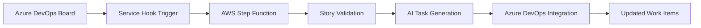

# Introduction

Welcome to **Task Genie** - your AI-powered assistant that revolutionizes how teams work with Azure DevOps Boards. Task Genie seamlessly integrates with your existing Azure DevOps workflow to ensure user story completeness and automatically breaks them down into actionable tasks, streamlining the Agile process and enhancing developer productivity.

## What is Task Genie?

Task Genie is an intelligent Agile enhancement tool that combines the power of AI with Azure DevOps integration to solve common challenges in sprint planning and story management. By leveraging advanced language models and Retrieval-Augmented Generation (RAG), Task Genie ensures your user stories are complete, well-structured, and automatically decomposed into manageable development tasks.

## Key Problems Task Genie Solves

### 🎯 **Incomplete User Stories**

Many user stories lack essential components like clear acceptance criteria, proper context, or technical details. Task Genie validates your stories against Agile best practices and identifies missing elements.

### 📋 **Manual Task Breakdown**

Breaking down user stories into actionable tasks is time-consuming and often inconsistent. Task Genie automates this process while maintaining alignment with Agile methodologies.

### 🔄 **Context Loss**

Teams often lose important domain knowledge and technical context when creating tasks. Task Genie uses RAG to incorporate relevant organizational knowledge, technical documentation, and domain-specific information.

### 📊 **Workflow Inefficiencies**

Without proper insights into story quality and task generation patterns, teams struggle to improve their processes. Task Genie provides analytics to optimize your workflow.

## How Task Genie Works

Task Genie operates through a sophisticated serverless architecture deployed on AWS, orchestrated by Step Functions to ensure reliable and scalable AI processing:

### 🔍 **Story Validation Process**

1. **Automated Analysis**: When a user story is created or updated in Azure DevOps, Task Genie automatically analyzes its completeness
2. **Best Practice Validation**: Checks for essential components like user personas, acceptance criteria, and clear descriptions
3. **Contextual Enhancement**: Uses organizational knowledge base to identify missing technical or domain-specific details
4. **Improvement Suggestions**: Provides actionable recommendations to enhance story quality

### 🤖 **AI-Powered Task Generation**

1. **Intelligent Decomposition**: Breaks down validated user stories into smaller, actionable development tasks
2. **Context-Aware**: Incorporates technical requirements, architectural patterns, and team conventions
3. **Agile-Compliant**: Ensures tasks follow Agile principles and can be completed within sprint timeframes
4. **Automatic Integration**: Creates tasks directly in Azure DevOps with proper linking and categorization

## Architecture Overview

Task Genie is built on a modern, serverless architecture that ensures scalability, reliability, and cost-effectiveness:

### **Cloud Infrastructure**

- **AWS Serverless**: Built entirely on AWS Lambda, Step Functions, and managed services
- **Auto-scaling**: Automatically handles varying workloads without manual intervention
- **Cost-Optimized**: Pay-per-use model with estimated monthly costs around $24

### **Integration Layer**

- **Azure DevOps Service Hooks**: Real-time integration with your existing Azure DevOps boards
- **REST API**: Secure API endpoints for custom integrations and frontend access
- **Extension Support**: Native Azure DevOps extension for seamless user experience

### **AI & Knowledge Management**

- **Amazon Bedrock**: Leverages state-of-the-art language models (Claude, etc.)
- **RAG Implementation**: Combines AI with your organizational knowledge base
- **Vector Search**: Efficient retrieval of relevant context and documentation

## Getting Started

Task Genie can be deployed and integrated with your Azure DevOps environment in several ways:

### **Option 1: Azure DevOps Extension**

Install the Task Genie extension directly from the Azure DevOps marketplace for immediate access to AI-powered task generation within your work item forms.

### **Option 2: Service Hook Integration**

Configure Azure DevOps Service Hooks to automatically trigger Task Genie when work items are created or updated.

### **Option 3: Web Dashboard**

Access the full-featured web dashboard for advanced analytics, bulk operations, and administrative functions.

## Technology Stack

Task Genie leverages modern technologies to deliver a robust and scalable solution:

| Component       | Technology                        | Purpose                                          |
| --------------- | --------------------------------- | ------------------------------------------------ |
| **Backend**     | AWS Lambda, Step Functions        | Serverless API and workflow orchestration        |
| **Frontend**    | Next.js, TypeScript, Tailwind CSS | Modern React-based user interface                |
| **AI/ML**       | Amazon Bedrock, RAG               | Advanced language models and knowledge retrieval |
| **Integration** | Azure DevOps REST API             | Seamless Azure DevOps connectivity               |
| **Database**    | DynamoDB, S3                      | Scalable data storage and vector search          |
| **Monitoring**  | CloudWatch, X-Ray                 | Comprehensive observability and analytics        |

## What's Next?

Ready to transform your Agile workflow? Here's what you can explore:

- **[Quick Start Guide](./docs/getting-started/installation.md)**: Set up Task Genie in under 10 minutes
- **[API Reference](/docs/api)**: Integrate Task Genie with custom applications
- **[Best Practices](./guides/best-practices.md)**: Optimize your user stories and workflow

Join thousands of teams already using Task Genie to streamline their Agile processes and boost productivity! 🚀
